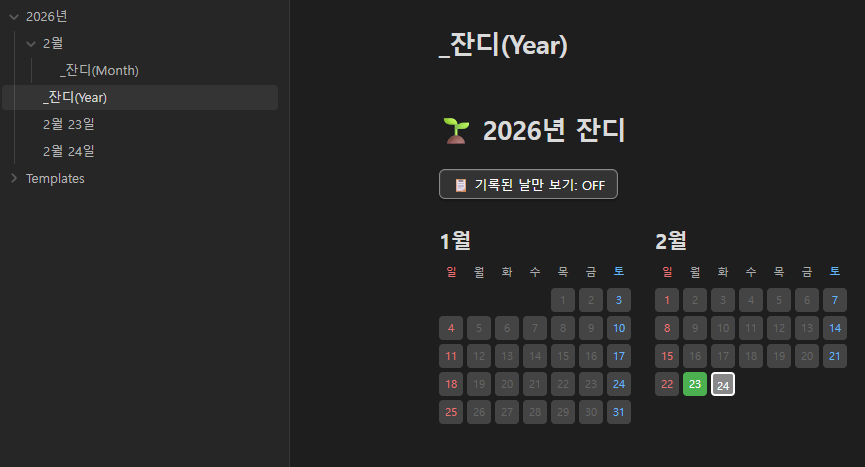
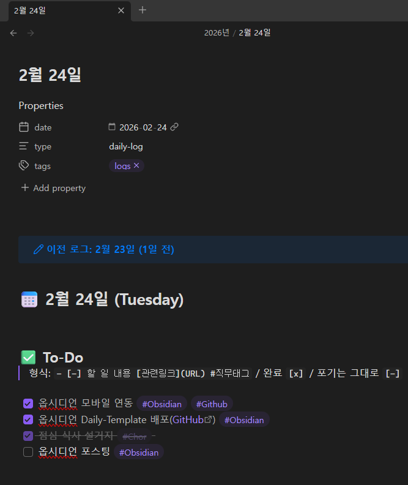

# 🌱 Obsidian Daily Template

데일리 노트 기반의 할 일 관리 Obsidian 볼트 템플릿입니다.
미완료 항목 자동 이월, 잔디 캘린더, 3단계 체크박스 시스템을 제공합니다.




---

## ✨ 주요 기능

- **데일리 노트** 날짜 기반 자동 파일명 생성
- **미완료 항목 자동 이월** — 가장 최근 데일리 로그에서 미완료 항목을 자동으로 가져옴
- **잔디 캘린더** — 연간/월간 완료 현황을 달력 형태로 시각화
- **3단계 체크박스** — 진행중 / 완료 / 스킵 구분
- **커스텀 CSS** — 체크박스 상태별 직관적인 스타일 적용

---

## 📦 필수 플러그인

**설정 → 커뮤니티 플러그인**에서 아래 플러그인을 설치하세요:

| 플러그인 | 용도 |
|---|---|
| [Templater](https://obsidian.md/plugins?id=templater-obsidian) | 동적 파일 생성을 위한 템플릿 엔진 |
| [Dataview](https://obsidian.md/plugins?id=dataview) | 데일리 로그 데이터 쿼리 및 렌더링 |

> ⚠️ Dataview 설정에서 **"Enable JavaScript Queries"** 와 **"Enable Inline JavaScript Queries"** 를 활성화하세요.

---

## ⚙️ 설정 방법

### 1. Templater 설정
- **설정 → 커뮤니티 플러그인 → Templater**
- **Template folder** 를 `Templates` 로 설정
- *(선택)* **Trigger Templater on new file creation** 활성화
- *(선택)* **Enable folder templates** 활성화 후 폴더 템플릿 규칙 추가:
  - Folder: *(데일리 노트를 저장할 폴더)*
  - Template: `Templates/Daily-Template`

> 💡 폴더 템플릿을 설정하면 해당 폴더에 새 파일 생성 시 템플릿이 자동 적용됩니다. 설정하지 않아도 우클릭 메뉴의 **"Create new note from template"** 으로 수동 적용할 수 있습니다.

### 2. CSS 스니펫
- **설정 → Appearance → CSS Snippets**
- `task-style` 토글 활성화
- `[x]` 완료 항목의 취소선 제거, `[-]` 스킵 항목에 취소선 적용

---

## 📁 폴더 구조

월별 폴더 사용 시:
```
YYYY년/
├── MM월/
│   ├── M월 D일.md       ← 데일리 노트
│   └── _잔디(Month).md  ← 월간 잔디 캘린더
└── _잔디(Year).md       ← 연간 잔디 캘린더
```

월별 폴더 없이 연단위 사용 시:
```
YYYY년/
├── M월 D일.md           ← 데일리 노트
└── _잔디(Year).md       ← 연간 잔디 캘린더
```

---

## 📋 템플릿 목록

| 템플릿 | 설명 | 생성 파일명 |
|---|---|---|
| `Daily-Template` | 오늘 날짜 데일리 노트 | `M월 D일` |
| `Daily-Template-For` | 특정 날짜 데일리 노트 (날짜 직접 입력) | `M월 D일` |
| `Month-Template` | 월간 잔디 캘린더 | `_잔디(Month)` |
| `Year-Template` | 연간 잔디 캘린더 | `_잔디(Year)` |

> 💡 Month/Year 템플릿은 **폴더명에서 날짜를 자동으로 파싱**합니다. `2026년`, `2월`, `2026년(회사)`, `2월-개인` 등 다양한 형식을 지원합니다.

---

## ✅ 체크박스 상태

| 상태 | 의미 | 다음날 이월 |
|---|---|---|
| `- [-]` | 진행중 (기본값) | ✅ 이월됨 |
| `- [x]` | 완료 | ❌ 이월 안 됨 |
| `- [-]` 유지 | 스킵 / 취소 | ❌ 이월 안 됨 (수동으로 제거) |

> 체크박스 클릭 시 `[x]` 로 변경됩니다. 스킵하거나 취소할 항목은 `[-]` 로 유지하세요.

---

## 🌿 잔디 캘린더

- 🟩 **초록색** — 모든 할 일 완료
- ⬛ **밝은 회색** — 데일리 노트는 있지만 미완료 항목 존재
- ⬛ **어두운 회색** — 해당 날짜 데일리 노트 없음
- 오늘 날짜는 **흰색 테두리**로 표시
- **"기록된 날만 보기"** 토글로 노트가 있는 날만 표시 가능

---

## 📝 Version
v2026.02.24
